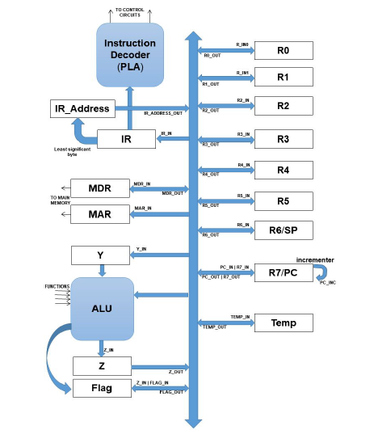
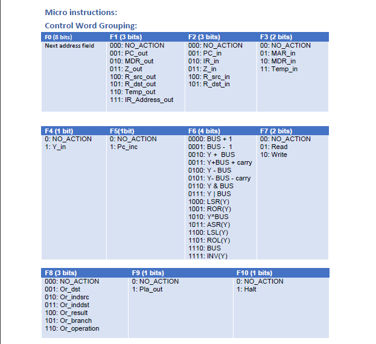
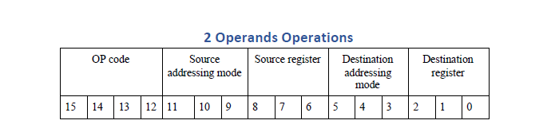
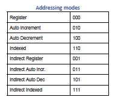

# PDP-11
The project aims to enforce the concepts of computer architecture by designing and simulating a 16-bit processor inspired by ideas from the famous PDP-11 processor.

## Processor Design

## Control word design

## Instruction Register design
### Double Operand Instructions:

The Supported Instructions are :
- Add 
- SUB (Subtract)
- ADC (Add with carry)
- SBC (Subtract with carry)
- AND 
- OR
- XOR
- CMP (Compare to set flags)

### Single Operand Instructions:

The Supported Instructions are :
- INC (Increment)
- DEC (Decrement)
- CLR (Clear)
- INV (Invert)
- LSR (Logic shift right)
- ROR (Rotate right)
- ASR (Arithmetic shift right)
- LSL (Logic shift left)
- ROL (Rotate Left)

### Branching Instructions:

The Supported Instructions are :
- BR (Branch unconditionally)
- BEQ (Branch if equal)
- BNE (Branch if not equal)
- BLO (Branch if lower)
- BLS (Branch if lower or same)
- BHI (Branch if Higher)
- BHS (Branch if Higher or same)

### Special Instructions:

The Supported Instructions are : 
- HLT (Halt)
- NOP (No operation)
- JSR (Jump service routine)
- RTS (Return from service routine)

## Addressing modes supported:

## Assembler
An assembler is provided coded in c++ to convert input codes to the format understood by the designed processor.  \
[Assembler file](assembler.cpp)  \
The Assembler is compiled using `g++`

## Steps to run:
- Create a new project in Modelsim
- Add vhdl files as Existing files to the project
- Compile
- Compile the code file required to run using the assembler
- Replace the \<path according to working directory> in the do file of the program required to run according to the working directory or create a do file similar to the ones in the [dofiles](dofiles) directory.  \
The created do file should :
  - load the [rom](rom.mem) file
  -  load the mem file of the program required to run 
- run the do file

## Tools: 
- Modelsim Altera version
- vscode

## Contributers:
- [Hossam Alaa](https://github.com/hossamalaa69)
- [Muhammed Ahmad Hesham](https://github.com/Etshawy1)
- [Muhammed Alaa](https://github.com/MuhammeedAlaa)
- [Mahmoud Gody](https://github.com/Moodrammer)

